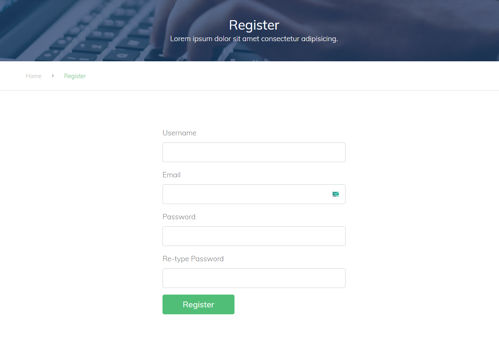

# Academic Management Portal

This project has added a backend with PHP and user registration, login and authorisation processes have been performed. This backend allows users to register and log in, and provides authorisation and management functions according to different access levels. With features such as the separation of administrator and user roles, the functionality and user experience of the system has been increased. 

## Features

- **Authorisation and Management:** There is an authorisation control system that allows users to be authorised and managed according to different access levels. The functionality of the system has been increased with features such as separation of administrator and user roles. The administrator can change the role of the normal user
- **Login:** There is a login module that allows registered users to log in to the system. This feature provides access to the system by verifying username and password.
- **User Registration (Register):** This system allows users to create an account by entering their personal information.

## How to Run

1. Clone the project from GitHub or download it as a zip file and extract it to your computer.

    ```bash
    git clone https://github.com/Arastaci/academic-management-portal.git
    ```

2. Open a terminal or command prompt and navigate to the root directory of the project.

    ```bash
    cd academic-management-portal
    ```

3. Start the project using a web server like Apache or Nginx.

4. Open a web browser and go to `http://localhost/` to access the application.

## Sample Users

Here are some sample users you can use to log in to the application:

| Email | Password  |
| -------- | --------- |
| admin@admin.com    | admin  |
| user@user.com     | user   |
## Images



